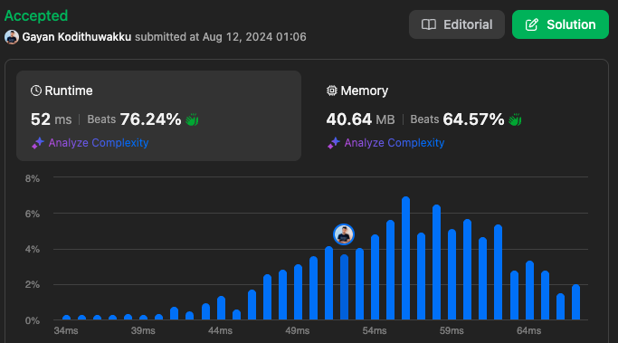

# 67. Add Binary

[Go to the problem on Leetcode](https://leetcode.com/problems/add-binary)

### Intuition
The problem of adding two binary strings can be approached similarly to how you would add two decimal numbers. You start adding from the rightmost digit (least significant bit) and move left, carrying over when the sum exceeds 1 (since it's binary). By appending each result to a string, you can build the final binary sum.

### Approach
1. **Initialization**:
   - Use two pointers, `i` and `j`, initialized to the last indices of strings `a` and `b`, respectively. These will help traverse the strings from right to left.
   - Use a `carry` variable to handle the carry-over during the addition process.
   - Use a `StringBuilder` to construct the result.

2. **Iterate and Add**:
   - Loop until both pointers are out of bounds (`i < 0` and `j < 0`) and there is no carry left.
   - In each iteration, calculate the sum of the current digits from `a` and `b`, along with the `carry`.
   - Append the least significant bit of the sum (`sum % 2`) to the `StringBuilder`.
   - Update the `carry` to be the most significant bit of the sum (`sum / 2`).

3. **Reverse the Result**:
   - Since the digits are appended in reverse order (from least significant to most significant), reverse the final string to get the correct binary result.

4. **Return the Result**:
   - Convert the `StringBuilder` to a string and return it.

### Complexity
- **Time complexity**: `O(max(N, M))`  
  The time complexity is linear in terms of the length of the longer string between `a` and `b`. Each bit is processed once.
  
- **Space complexity**: `O(max(N, M))`  
  The space complexity is linear because the `StringBuilder` stores the resulting binary string, which is at most `max(N, M) + 1` in length.

### Code

```csharp
public class Solution {
    public string AddBinary(string a, string b) {
        StringBuilder result = new StringBuilder();
        int i = a.Length - 1;
        int j = b.Length - 1;
        int carry = 0;
        
        while (i >= 0 || j >= 0 || carry > 0) {
            int sum = carry;
            if (i >= 0) sum += a[i--] - '0';
            if (j >= 0) sum += b[j--] - '0';
            
            result.Append(sum % 2);
            carry = sum / 2;
        }
        
        // Reverse the result since we've been appending the digits in reverse order
        char[] charArray = result.ToString().ToCharArray();
        Array.Reverse(charArray);
        return new string(charArray);
    }
}

