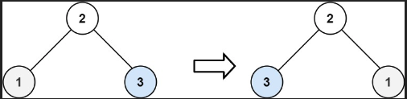

# 226. Invert Binary Tree

[Go to the problem on Leetcode](https://leetcode.com/problems/invert-binary-tree/)

## Intuition

The problem asks us to invert a binary tree. Inverting a binary tree means swapping every left child with its corresponding right child. Think of it like looking at the tree in a mirror. The left side becomes the right side and vice versa.

## Approach

1. **Base Case:** 
   - If the tree is empty (`root` is `null`), there's nothing to invert, so we return `null`.

2. **Swap Children:**
   - For a given node, swap its left and right children. This means that the left child becomes the right child and the right child becomes the left child.

3. **Recursively Invert Subtrees:**
   - After swapping the children of the current node, we recursively call the `invertTree` function on the left child and the right child (which have been swapped).
   - This recursive process continues until all nodes in the tree have been visited and their children swapped.

4. **Return the Root:**
   - Finally, after all nodes are processed, return the root of the inverted tree.

### Example:

Consider a simple binary tree:



Here’s how the function works step-by-step:

- Start at the root (`2`).
- Swap its children (`1` and `3`), so `1` becomes the right child and `3` becomes the left child.
- Recursively apply the same process to `3` and `1`.
- Since `3` and `1` are leaf nodes (no children), the recursion stops.

## Complexity

### Time Complexity:
- **O(n):** The function visits every node in the tree exactly once, where `n` is the number of nodes in the tree. Therefore, the time complexity is linear.

### Space Complexity:
- **O(h):** The space complexity is determined by the height of the tree `h`, due to the recursive calls that are stored in the function call stack. In the worst case, when the tree is completely unbalanced (like a linked list), the height is `n`, making the space complexity O(n). In the best case, when the tree is balanced, the height is `log(n)`.

## Code

```java
/**
 * Definition for a binary tree node.
 * public class TreeNode {
 *     int val;
 *     TreeNode left;
 *     TreeNode right;
 *     TreeNode() {}
 *     TreeNode(int val) { this.val = val; }
 *     TreeNode(int val, TreeNode left, TreeNode right) {
 *         this.val = val;
 *         this.left = left;
 *         this.right = right;
 *     }
 * }
 */
class Solution {
    public TreeNode invertTree(TreeNode root) {
        if (root == null) return root;  // Base case: If the tree is empty

        // Swap the left and right children of the current node
        TreeNode t = root.left;
        root.left = root.right;
        root.right = t;

        // Recursively invert the left and right subtrees
        invertTree(root.left);
        invertTree(root.right);

        return root;  // Return the root node after inverting
    }
}